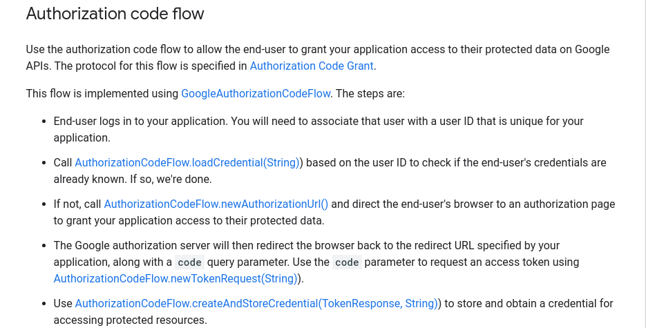

### Resources
* [Introduction to google drive api](https://developers.google.com/drive/api/v3/about-sdk)
* [How to request access only to application specific folder instead of the whole disk](https://developers.google.com/drive/api/v3/appdata)
* [Working with OAuth in Spring Boot application](https://spring.io/guides/tutorials/spring-boot-oauth2/)
* [How to store application-specific data on Google Drive](https://developers.google.com/drive/api/v3/appdata)

# IMPORTANT
Looks like [this](https://developers.google.com/api-client-library/java/google-api-java-client/oauth2)
is a link with full google oauth authentication process description
 
